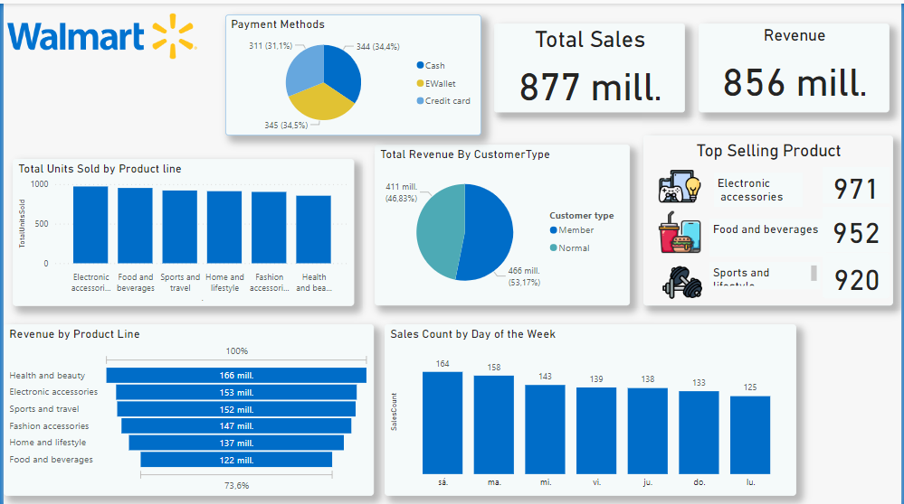

# WALMART SALES INSIGHTS THROUGH SQL

## Overview

Welcome to my SQL analysis project of Walmart's sales data. In this project, I look closely at how much Walmart earns from different products, what products are popular, and who buys them. I also check when and where Walmart sells the most.

## Goals

- To look into Walmart's detailed sales records for useful information.
- To find out which products make the most money and which ones are favorites.
- To see who Walmart's customers are and what they like to buy.
- To figure out when Walmart has its best sales.

## How I Did It

I used SQL, which is a computer language for sorting and understanding data. I asked questions like:
- Which products sell the most?
- Who is buying these products?
- When do people shop the most?

## The Data

I used Walmart's sales records for this study. These records show what was bought, how much it cost, and who bought it. This information helps us see the whole picture of Walmart's sales.

## Tools I Used

- **SQL**: To organize the data and find out interesting things from it.
- **Graphs and Charts**: To make the results easy to understand.

## Findings

My study shows what works well for Walmart and where they can do better. It gives a clear picture of how Walmart is doing in terms of sales.

## Visuals

I used pictures and graphs to make the information clear. Here is one of the charts from my study:

 

## Try It Yourself

If you want to see how I did my analysis:
1. Download the files from this page.
2. Make sure you can use SQL on your computer.
3. Open and run the SQL files I have here.

## Get Involved

I welcome any thoughts or help to make this project even better. If you have ideas, please share them with me.

## Questions?

If you have any questions or just want to talk about the project, feel free to contact me.

Thank you for checking out my Walmart sales analysis!

